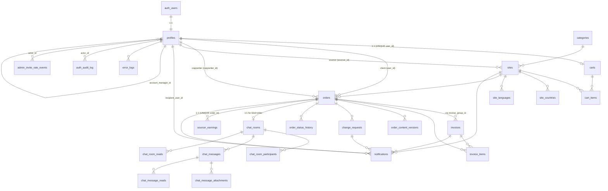

# Database Structure

Complete reference for the Supabase/Postgres schema behind this app. Pairs with `docs/ai/database.md` (narrative) and `lib/supabase/types/database.types.new.ts` (TypeScript source of truth).

- **Postgres major version:** 17 (see `supabase/config.toml`).
- **Migration order:** `supabase/migrations/` is chronological. Never edit a pushed migration — add a new ALTER.
- **Auth model:** identities live in `auth.users` (Supabase); app data lives in `public.profiles` (1:1 with `auth.users`).
- **Type regen:** `npx supabase gen types typescript --local > lib/supabase/types/database.types.new.ts`.

---

## 1. Role / Access Model

### Roles (`user_role` enum)

`admin` · `manager` · `client` · `sourcer` · `copywriter`

Stored in `profiles.role` (NOT NULL, default `client`). Read at runtime via the SECURITY DEFINER function `public.get_my_role()` which queries `profiles WHERE id = auth.uid()` (avoids RLS recursion).

### Layered enforcement

- **DB layer (RLS + triggers):** every public table has RLS on; transitions are guarded by triggers (orders, sites). Service role bypasses RLS — used only in Server Actions.
- **App layer (Server Actions):** every action does a session lookup + role gate before touching `adminClient`. Pattern: `getSessionContext()` → role check → mutate.

### Single-admin invariant

- Exactly **one** `profiles.role = 'admin'` (partial unique index).
- Bootstrap: create in Supabase Dashboard with metadata `{ "is_bootstrap_admin": true, "role": "admin", "full_name": "..." }`. `handle_new_user` honors this.
- `public.bootstrap_signup_allowed()` is a compatibility stub that always returns `false`. Public sign-up must also be disabled in Supabase Auth settings.

### Invite flow

- Staff invited via `inviteUserByEmail` (Server Action with admin client).
- `profiles.require_password_change = true` until they set a password. Cleared by service role only (DB trigger enforces).
- App shell redirects to `/auth/first-login-password` while flag is set (`app/(app)/layout.tsx:38–40`).
- `profiles_block_admin_promotion` BEFORE UPDATE trigger blocks any non-service-role role change to `admin`.

### Supabase clients (pick the right one)

| File                     | Used for                                                                   | RLS      |
| ------------------------ | -------------------------------------------------------------------------- | -------- |
| `lib/supabase/server.ts` | Server Components, most Server Actions                                     | enforced |
| `lib/supabase/client.ts` | `'use client'` components, Realtime                                        | enforced |
| `lib/supabase/admin.ts`  | Server Actions needing privileged writes — **never import in client code** | bypassed |

---

## 2. ERD (Mermaid)



---

## 3. Tables (public schema)

Column legend: `PK` primary key · `FK→T(c)` foreign key with target · `UQ` unique · `NN` not null · `D=` default.

### `profiles`

1:1 with `auth.users`. App-side identity.

| Column                              | Type        | Notes                                                 |
| ----------------------------------- | ----------- | ----------------------------------------------------- |
| `id`                                | UUID        | PK, FK→`auth.users(id)` ON DELETE CASCADE             |
| `role`                              | `user_role` | NN, D=`client`                                        |
| `full_name`                         | TEXT        |                                                       |
| `avatar_url`                        | TEXT        |                                                       |
| `company_name`                      | TEXT        |                                                       |
| `phone`                             | TEXT        |                                                       |
| `bio`                               | TEXT        |                                                       |
| `email`                             | TEXT        | Mirror of `auth.users.email`, kept in sync by trigger |
| `require_password_change`           | BOOL        | D=false; true for invited staff                       |
| `account_manager_id`                | UUID        | FK→`profiles(id)` ON DELETE SET NULL                  |
| `last_automated_invite_reminder_at` | TIMESTAMPTZ | cron throttle                                         |
| `created_at`, `updated_at`          | TIMESTAMPTZ | D=`now()`                                             |

- **Indexes:** `idx_profiles_role`; partial UNIQUE on `role='admin'` (single-admin invariant).
- **Triggers:** `set_updated_at`, `sync_profile_email_on_auth_user`, `profiles_block_admin_promotion`, `on_profile_role_set_chat_join`, `on_profile_role_changed_chat_join`.
- **RLS:** users SELECT/UPDATE their own row; `manager` and `admin` SELECT any (Settings → Users uses this). Role column is immutable except via service role or admin.

### `categories`

| Column       | Type        | Notes                                |
| ------------ | ----------- | ------------------------------------ |
| `id`         | SERIAL      | PK                                   |
| `name`       | TEXT        | NN UQ                                |
| `slug`       | TEXT        | NN UQ                                |
| `created_by` | UUID        | FK→`profiles(id)` ON DELETE SET NULL |
| `created_at` | TIMESTAMPTZ | D=`now()`                            |

- **Trigger:** `categories_set_created_by` (BEFORE INSERT, sets `created_by = auth.uid()` if NULL).
- **RLS:** authenticated SELECT; admin INSERT/UPDATE/DELETE.

### `sites`

| Column                                                                               | Type                  | Notes                                     |
| ------------------------------------------------------------------------------------ | --------------------- | ----------------------------------------- |
| `id`                                                                                 | UUID                  | PK, D=`gen_random_uuid()`                 |
| `domain`                                                                             | TEXT                  | NN UQ                                     |
| `status`                                                                             | `site_status`         | NN, D=`pending`                           |
| `category_id`                                                                        | INT                   | NN FK→`categories(id)` ON DELETE RESTRICT |
| `dr`                                                                                 | SMALLINT              | CHECK 0..100                              |
| `price`                                                                              | NUMERIC(10,2)         | NN, CHECK ≥0                              |
| `link_type`                                                                          | `link_type`           | NN, D=`dofollow`                          |
| `requirements`, `description`, `contact_info`, `keywords_relevance`, `top_countries` | TEXT                  |                                           |
| `organic_keywords_count`, `organic_traffic_count`                                    | INT                   | CHECK ≥0                                  |
| `sourcer_id`                                                                         | UUID                  | FK→`profiles(id)` ON DELETE SET NULL      |
| `sourcer_notes`                                                                      | TEXT                  |                                           |
| `needs_changes_by`, `needs_changes_at`, `needs_changes_comment`                      | UUID/TIMESTAMPTZ/TEXT | admin feedback; cleared on sourcer edit   |
| `approved_by`, `approved_at`                                                         | UUID, TIMESTAMPTZ     |                                           |
| `created_at`, `updated_at`                                                           | TIMESTAMPTZ           |                                           |

- **Indexes:** `idx_sites_status`, `idx_sites_category_id`, `idx_sites_price`, `idx_sites_dr`, `idx_sites_domain_fts` (GIN FTS on domain), `idx_sites_status_domain`, `idx_sites_sourcer_status_domain`, `idx_sites_sourcer_assigned` (partial).
- **Triggers:** `set_updated_at`, `sites_enforce_sourcer_defaults` (BEFORE INS/UPD), `enforce_site_status_transition` (BEFORE UPD of status).
- **Status transitions:** `pending → {needs_changes, active, archived}` · `needs_changes → {active, archived}` · `active ↔ {needs_changes, archived}` · `archived → active`.
- **RLS:** clients see `status='active'` only; staff see all; admin DELETE.

### `site_countries` / `site_languages`

Composite PK `(site_id, country|language)`. Managed via `replace_site_countries_and_languages()` RPC. RLS: authenticated SELECT; admin write.

### `carts`

One per user. `user_id` UNIQUE FK→`profiles(id)` ON DELETE CASCADE. Auto-created by `on_profile_created` trigger.

### `cart_items`

| Column                                      | Type        | Notes                                                    |
| ------------------------------------------- | ----------- | -------------------------------------------------------- |
| `id`                                        | UUID        | PK                                                       |
| `cart_id`                                   | UUID        | NN FK→`carts(id)` CASCADE                                |
| `site_id`                                   | UUID        | NN FK→`sites(id)` CASCADE, **UNIQUE (cart_id, site_id)** |
| `anchor_text`, `target_url`, `client_notes` | TEXT        |                                                          |
| `publish_date`                              | DATE        |                                                          |
| `publish_month`                             | DATE        | first day of month                                       |
| `created_at`, `updated_at`                  | TIMESTAMPTZ |                                                          |

- **Trigger:** `check_site_active_before_cart_insert` (rejects inactive sites).
- **RLS:** own cart only.

### `orders`

| Column                                                                                              | Type           | Notes                                                 |
| --------------------------------------------------------------------------------------------------- | -------------- | ----------------------------------------------------- |
| `id`                                                                                                | UUID           | PK                                                    |
| `user_id`                                                                                           | UUID           | NN FK→`profiles(id)` ON DELETE RESTRICT (client)      |
| `site_id`                                                                                           | UUID           | FK→`sites(id)` ON DELETE SET NULL                     |
| `status`                                                                                            | `order_status` | NN, D=`new`                                           |
| `price`                                                                                             | NUMERIC(10,2)  | NN                                                    |
| `copywriter_id`                                                                                     | UUID           | FK→`profiles(id)` ON DELETE SET NULL                  |
| `published_url`                                                                                     | TEXT           | required when status ∈ {published, completed} (CHECK) |
| `anchor_text`, `target_url`, `client_notes`                                                         | TEXT           |                                                       |
| `publish_date`, `publish_month`                                                                     | DATE           |                                                       |
| **Snapshots (immutable, captured at order insert):**                                                |                |                                                       |
| `site_domain`                                                                                       | TEXT           | NN                                                    |
| `site_dr`                                                                                           | SMALLINT       |                                                       |
| `site_category`                                                                                     | TEXT           | NN                                                    |
| `site_countries`, `site_languages`                                                                  | TEXT[]         | D=`{}`                                                |
| `site_link_type`                                                                                    | `link_type`    | NN                                                    |
| `site_requirements`, `site_description`, `site_contact_info`, `site_keywords_relevance`             | TEXT           |                                                       |
| `site_organic_keywords_count`, `site_organic_traffic_count`                                         | INT            |                                                       |
| **Lifecycle timestamps (set by trigger):**                                                          |                |                                                       |
| `assigned_at`, `content_submitted_at`, `approved_at`, `published_at`, `completed_at`, `canceled_at` | TIMESTAMPTZ    |                                                       |
| `created_at`, `updated_at`                                                                          | TIMESTAMPTZ    |                                                       |

- **Indexes:** `idx_orders_user_id`, `idx_orders_status`, `idx_orders_user_status`, `idx_orders_created_at DESC`, `idx_orders_site_id`, `idx_orders_copywriter_active` (partial).
- **Status flow** (guarded by `enforce_order_status_transition`, admin override allowed):
  `new → {in_progress, canceled}` · `in_progress → content_sent` · `content_sent → {content_approved, needs_changes}` · `needs_changes → {in_progress, content_sent}` · `content_approved → published` · `published → completed` · `completed`/`canceled` terminal.
- **Triggers:** `set_updated_at`, `on_order_created` (invoice + items), `on_order_created_chat_room` (chat seed), `on_order_copywriter_changed` (chat participant + system msg), `on_orders_apply_timestamps`, `on_orders_status_audit` (writes `order_status_history`), `enforce_order_status_transitions`, `on_order_earning_refresh`, `on_order_terminal_archive_chat`, `on_order_price_sync_invoice`.
- **RLS:** own orders SELECT; clients can cancel own `new` orders and review own `content_sent` orders (transitions guarded by trigger); staff UPDATE any. **Clients have no direct INSERT policy** — checkout uses `adminClient` in a Server Action.

### `invoices`

| Column                     | Type             | Notes                                                                   |
| -------------------------- | ---------------- | ----------------------------------------------------------------------- |
| `id`                       | UUID             | PK                                                                      |
| `order_id`                 | UUID             | FK→`orders(id)` CASCADE (not unique — invoice_group_id allows grouping) |
| `status`                   | `invoice_status` | NN, D=`draft` (`draft` · `sent` · `paid`)                               |
| `amount`                   | NUMERIC(10,2)    | NN, synced from `invoice_items` via trigger                             |
| `billing_month`            | DATE             |                                                                         |
| `invoice_group_id`         | UUID             | groups multiple orders into one invoice                                 |
| `due_date`                 | DATE             |                                                                         |
| `sent_at`, `paid_at`       | TIMESTAMPTZ      |                                                                         |
| `invoice_number`           | TEXT             | added 20260624000002                                                    |
| `created_at`, `updated_at` | TIMESTAMPTZ      |                                                                         |

- **Indexes:** `idx_invoices_status`, `idx_invoices_billing_month`, `idx_invoices_invoice_group_id`.
- **Triggers:** `set_updated_at`, `on_invoice_items_changed` (recomputes `amount`), `on_invoice_status_changed` (flips order → `completed` on paid).
- **RLS:** clients see their orders' invoices; staff full access.

### `invoice_items`

`(id, invoice_id, order_id, site_domain, amount)`. `on_invoice_items_changed` keeps `invoices.amount` in sync. Staff-managed.

### `order_content_versions`

| Column                                   | Type                   | Notes                                           |
| ---------------------------------------- | ---------------------- | ----------------------------------------------- |
| `id`                                     | UUID                   | PK                                              |
| `order_id`                               | UUID                   | NN FK→`orders(id)` CASCADE                      |
| `copywriter_id`                          | UUID                   | NN FK→`profiles(id)` RESTRICT                   |
| `status`                                 | `order_content_status` | `draft` · `submitted`                           |
| `version_number`                         | INT                    | NULL for drafts; required for submitted (CHECK) |
| `title`, `meta_description`, `body_html` | TEXT                   |                                                 |
| `word_count`                             | INT                    | CHECK ≥0                                        |
| `created_at`, `updated_at`               | TIMESTAMPTZ            |                                                 |

- **Indexes:** `order_content_versions_one_draft_per_order` (UNIQUE partial WHERE `status='draft'`), `order_content_versions_submitted_unique` (UNIQUE partial on `(order_id, version_number)` WHERE `status='submitted'`), plus order/copywriter indexes.
- **Triggers:** `enforce_submitted_content_immutable_upd` / `_del` — submitted rows can never be changed or deleted.
- **RLS:** copywriter sees own drafts + all submitted on their orders; client sees `submitted` only; staff full read. Copywriter can INSERT/UPDATE/DELETE drafts when `order.status ∈ {in_progress, needs_changes}`.

### `change_requests`

`(id, order_id, user_id, comment, status, resolved_by, resolved_at, resolution_reason, …)`. Status enum: `open` · `resolved` · `dismissed`.

- **Trigger:** `on_change_request_resolution_fields` (sets `resolved_at`/`resolved_by` when status moves to a terminal value).
- **RLS:** clients SELECT own; INSERT own when `order.status='content_sent'`; staff UPDATE.

### `order_status_history`

`(id, order_id, from_status, to_status, actor_user_id, comment, created_at)`. Populated by `audit_order_status_transition()` trigger. Indexed on `(order_id, created_at DESC)`.

### `notifications`

| Column                  | Type                 | Notes                             |
| ----------------------- | -------------------- | --------------------------------- |
| `id`                    | UUID                 | PK                                |
| `recipient_user_id`     | UUID                 | NN FK→`profiles(id)` CASCADE      |
| `actor_user_id`         | UUID                 | FK→`profiles(id)` SET NULL        |
| `event`                 | `notification_event` | NN                                |
| `title`, `message`      | TEXT                 | NN                                |
| `order_id`              | UUID                 | FK→`orders(id)` CASCADE           |
| `invoice_id`            | UUID                 | FK→`invoices(id)` SET NULL        |
| `change_request_id`     | UUID                 | FK→`change_requests(id)` SET NULL |
| `site_id`               | UUID                 | FK→`sites(id)` CASCADE            |
| `created_at`, `read_at` | TIMESTAMPTZ          |                                   |

- **Indexes:** `idx_notifications_recipient_created` (`recipient_user_id`, `created_at DESC`), `idx_notifications_recipient_unread` (partial WHERE `read_at IS NULL`).
- **Triggers:** none (notification-emitting triggers were dropped in `20260629120000`).
- **RLS:** own SELECT, own UPDATE (mark read), staff INSERT, admin DELETE.
- **Realtime publication:** `notifications` is in `supabase_realtime` — browser subscriptions filtered by `recipient_user_id` honor RLS.
- **Cron:** `cleanup-read-notifications` deletes `read_at IS NOT NULL AND read_at < now() - 7 days` every Sun 03:00 UTC.

### Chat tables (`chat_rooms`, `chat_room_participants`, `chat_messages`, `chat_message_attachments`, `chat_room_reads`, `chat_message_reads`)

- **`chat_rooms`** has `kind ∈ {order, direct, group}`, `channel ∈ {standard, support, sales}`, `status ∈ {active, archived}`, optional `order_id` (UNIQUE — one room per order), `system_managed`, `onboarding_for_user_id`, `title`, `created_by`. Indexes on `order_id` (partial), `kind`, `channel`.
- **`chat_room_participants`** composite PK `(room_id, user_id)` + `added_at`. Add/remove managed by triggers; RLS lets a user remove themselves.
- **`chat_messages`** has `room_id`, `sender_id` (NULL for system), `body`, `message_type ∈ {text, system}`. Soft-unsend: sender can DELETE within 5 min. Indexed on `(room_id, created_at DESC)`.
- **`chat_message_attachments`** holds `storage_path`, `file_name`, `mime_type`, `size_bytes`. Storage bucket: `chat-attachments` (private, member-only).
- **`chat_room_reads`** + **`chat_message_reads`** drive per-user read tracking.
- **Realtime publication:** `chat_messages`, `chat_room_reads`.
- **Trigger network:** `on_order_created_chat_room` (auto room + participants), `handle_order_copywriter_change` (add copywriter), `handle_new_staff_chat_join` / `handle_profile_role_change_chat_join` (auto-add admins/managers), `archive_order_chat_on_terminal`.

### `sourcer_earnings`

| Column                        | Type              | Notes                                                     |
| ----------------------------- | ----------------- | --------------------------------------------------------- |
| `id`                          | UUID              | PK                                                        |
| `sourcer_id`                  | UUID              | NN FK→`profiles(id)` CASCADE                              |
| `order_id`                    | UUID              | NN UQ FK→`orders(id)` CASCADE (one earning row per order) |
| `site_id`                     | UUID              | FK→`sites(id)` SET NULL                                   |
| `invoice_id`                  | UUID              | FK→`invoices(id)` SET NULL                                |
| `earned_amount`               | NUMERIC(10,2)     | NN, CHECK ≥0                                              |
| `commission_rate`             | NUMERIC(5,4)      | D=0.10, CHECK 0..1                                        |
| `earning_month`               | DATE              | NN                                                        |
| `payout_status`               | TEXT              | D=`unpaid`, CHECK ∈ {`unpaid`, `paid`}                    |
| `paid_at`, `payout_reference` | TIMESTAMPTZ, TEXT |                                                           |

- **Trigger:** `on_order_earning_refresh` calls `refresh_sourcer_earning_for_order()` — creates/updates a row when order ∈ {published, completed} and the site has a sourcer; otherwise deletes (potential earning).
- **Indexes:** `(sourcer_id, earning_month DESC)`, `payout_status`.
- **RLS:** sourcer sees own; staff sees all; staff manages payout.

### Audit / ops tables

- **`error_logs`** — `level`, `context`, `message`, `payload (JSONB)`, `user_id`. Admin SELECT; authenticated INSERT (append-only). Indexes on `created_at DESC`, `level`, `context`.
- **`order_status_history`** — see above.
- **`admin_invite_rate_events`** — rate-limit ledger for `inviteUserByEmail`. Service-role managed.
- **`public_rate_limit_events`** — generic public rate-limit ledger.
- **`auth_audit_log`** — `(action, actor_id, target_email, meta JSONB, created_at)`. Service-role write.

---

## 4. Enums

| Enum                    | Values                                                                                                                                                                                                                                                                      |
| ----------------------- | --------------------------------------------------------------------------------------------------------------------------------------------------------------------------------------------------------------------------------------------------------------------------- |
| `user_role`             | `client`, `admin`, `sourcer`, `manager`, `copywriter`                                                                                                                                                                                                                       |
| `order_status`          | `new`, `in_progress`, `content_sent`, `needs_changes`, `content_approved`, `published`, `completed`, `canceled`                                                                                                                                                             |
| `invoice_status`        | `draft`, `sent`, `paid` (migrated from older pending/overdue/paid/canceled in 20260615120000)                                                                                                                                                                               |
| `site_status`           | `active`, `inactive`, `pending`, `needs_changes`, `approved`, `archived`                                                                                                                                                                                                    |
| `change_request_status` | `open`, `resolved`, `dismissed`                                                                                                                                                                                                                                             |
| `link_type`             | `dofollow`, `nofollow`, `sponsored`, `ugc`                                                                                                                                                                                                                                  |
| `chat_room_kind`        | `order`, `direct`, `group`                                                                                                                                                                                                                                                  |
| `chat_room_status`      | `active`, `archived`                                                                                                                                                                                                                                                        |
| `chat_message_type`     | `text`, `system`                                                                                                                                                                                                                                                            |
| `chat_channel_type`     | `standard`, `support`, `sales`                                                                                                                                                                                                                                              |
| `order_content_status`  | `draft`, `submitted`                                                                                                                                                                                                                                                        |
| `notification_event`    | `order_created`, `copywriter_assigned`, `copywriter_reassigned`, `content_submitted`, `changes_requested`, `content_approved`, `order_published`, `invoice_paid`, `invoice_sent`, `site_needs_changes`, `site_approved`, `site_archived`, `site_unarchived`, `chat_message` |

---

## 5. Triggers & Functions (cheat sheet)

### Helpers

- `set_updated_at()` — BEFORE UPDATE on all tables with `updated_at`.
- `get_my_role()` — STABLE SECURITY DEFINER, returns the caller's `profiles.role`. RLS policies reference it instead of selecting from `profiles` (avoids recursion).
- `is_chat_participant(room_id, user_id)` — STABLE SECURITY DEFINER, used by chat RLS.
- `bootstrap_signup_allowed()` — stub returning `false`.
- `auth_user_email_exists(p_email)` — exists-check for auth flows.

### Profile lifecycle

- `handle_new_user()` — AFTER INSERT on `auth.users`. Creates `profiles` row, applies metadata (`role`, `is_bootstrap_admin`, `full_name`), sets `require_password_change` for invited staff.
- `handle_new_profile()` — AFTER INSERT on `profiles`. Auto-creates a cart.
- `sync_profile_email_from_auth()` — keeps `profiles.email` in sync with `auth.users.email`.
- `profiles_block_admin_promotion()` — BEFORE UPDATE OF `role`. Only service role or bootstrap can set `admin`.

### Orders & invoices

- `enforce_order_status_transition()` — guards allowed transitions; raises `P0001`.
- `apply_order_timestamps()` — sets `assigned_at`, `content_submitted_at`, `approved_at`, `published_at`, `completed_at`, `canceled_at`.
- `audit_order_status_transition()` — writes `order_status_history`.
- `handle_new_order()` — creates invoice (`draft`, `due_date = now + 30d`) and one invoice item.
- `sync_invoice_total_from_items()` — recomputes `invoices.amount` whenever items change.
- `sync_draft_invoice_item_from_order_price()` — propagates order price changes to the draft invoice item; rejects if invoice has moved beyond draft.
- `handle_invoice_paid()` — invoice → `paid` flips order → `completed`.

### Content workflow

- `enforce_submitted_content_immutable()` — locks submitted rows.

### Change requests

- `set_change_request_resolution_fields()` — sets `resolved_at`/`resolved_by` on terminal status.

### Sites

- `sites_enforce_sourcer_defaults()` — sourcer self-assigns; sourcer edit resets `status='pending'` and clears admin feedback.
- `enforce_site_status_transition()` — guards allowed transitions.
- `replace_site_countries_and_languages()` (RPC) — atomic replace of geo/lang rows.

### Chat

- `handle_new_order_chat_room()` — seeds room + participants.
- `handle_order_copywriter_change()` — adds new copywriter to chat.
- `handle_new_staff_chat_join()` / `handle_profile_role_change_chat_join()` — auto-add admin/manager to existing rooms.
- `archive_order_chat_on_terminal()` — archives chat when order reaches `completed`/`canceled`.

### Earnings

- `refresh_sourcer_earning_for_order()` + `handle_order_earning_refresh()` — upsert/delete `sourcer_earnings` based on order state.

### Notifications

**No longer DB-emitted.** Triggers `on_order_notify_update`, `on_invoice_notify_paid`, `on_change_request_notify_insert` and their functions (`notify_on_order_update`, `notify_invoice_paid`, `notify_change_request_insert`, `create_order_event_notification`) were dropped in `20260629120000`. All emission is now in `lib/notifications/*` Server Actions — see §8.

---

## 6. RLS Summary

| Table                                    | SELECT                                    | INSERT                                                      | UPDATE                                                 | DELETE              |
| ---------------------------------------- | ----------------------------------------- | ----------------------------------------------------------- | ------------------------------------------------------ | ------------------- |
| `profiles`                               | own; admin/manager any                    | (via auth trigger)                                          | own non-role fields; admin any                         | service role        |
| `categories`                             | authenticated                             | admin                                                       | admin                                                  | admin               |
| `sites`                                  | clients: `active` only; staff: all        | sourcer (trigger-defaulted)                                 | staff                                                  | admin               |
| `site_countries`/`_languages`            | authenticated                             | admin                                                       | admin                                                  | admin               |
| `carts`                                  | own; staff                                | trigger-auto                                                | own                                                    | own                 |
| `cart_items`                             | own cart; staff                           | own cart (active site only)                                 | own cart                                               | own cart            |
| `orders`                                 | own; staff                                | **none direct** — Server Action with `adminClient`          | client cancel `new` / review `content_sent`; staff any | admin               |
| `invoices`                               | own (via order); staff                    | staff                                                       | staff                                                  | staff               |
| `invoice_items`                          | own (via order); staff                    | staff (trigger)                                             | staff (trigger)                                        | staff               |
| `order_content_versions`                 | copywriter own; client (submitted); staff | copywriter draft when order in {in_progress, needs_changes} | copywriter draft                                       | copywriter draft    |
| `change_requests`                        | own; staff                                | own when `order.status='content_sent'`                      | staff                                                  | none                |
| `order_status_history`                   | order visible to caller                   | staff                                                       | none                                                   | none                |
| `notifications`                          | own (`recipient_user_id = auth.uid()`)    | staff (admin/manager) via Server Action                     | own (mark read)                                        | admin               |
| `chat_rooms`                             | participant; admin                        | trigger-managed                                             | trigger-managed                                        | trigger-managed     |
| `chat_room_participants`                 | participants                              | trigger-managed                                             | trigger-managed                                        | self only           |
| `chat_messages`                          | participant                               | participant, `sender_id = auth.uid()`, `type='text'`        | none                                                   | sender within 5 min |
| `chat_message_attachments`               | via parent message                        | via parent message                                          | none                                                   | sender              |
| `chat_room_reads` / `chat_message_reads` | own                                       | own                                                         | own                                                    | own                 |
| `sourcer_earnings`                       | own; staff                                | staff                                                       | staff                                                  | staff               |
| `error_logs`                             | admin                                     | authenticated                                               | none                                                   | none                |
| `auth_audit_log` / rate-limit tables     | service role                              | service role                                                | service role                                           | service role        |

---

## 7. Realtime, Cron, Views, Storage

- **Realtime publication (`supabase_realtime`):** `chat_messages`, `chat_room_reads`, `notifications`.
- **Cron (`pg_cron`):** `cleanup-read-notifications` (Sun 03:00 UTC — deletes read notifications >7 days old).
- **Views:** none (`Views: { [_ in never]: never }` in generated types).
- **Storage buckets:**
  - `avatars` (public, 2 MB, images). Path `<user_id>/<filename>`. Public SELECT, authenticated INSERT/UPDATE/DELETE on own path.
  - `chat-attachments` (private, 10 MB, images/pdf/office/text). Path `<room_id>/<uuid>-<filename>`. Member-only via `is_chat_participant`.

---

## 8. Notification Flow Architecture (current)

Emission is **app-layer only** as of `20260629120000`.

### Modules

- **`lib/notifications/notify-order-event.ts`** — single dispatcher for order/invoice events. Resolves recipients per event, generates **role-specific second-person copy**, batches into one `notifications` insert via `adminClient`. Fire-and-forget (logs on failure, never throws).
- **`lib/notifications/create-notification.ts`** — generic helper for non-order events (sites, chat). Still uses `getStaffUserIds()` for broader fan-out.
- **`lib/notifications/load-notifications.ts`** — RSC reads: paginated list, unread count, unread-by-event breakdown. Detects missing table and returns empty (graceful for fresh local clones).
- **`lib/notifications/notification-actions.ts`** — `markNotificationRead`, `markAllNotificationsRead`. Revalidates `/notifications` and `/` layout so the bell badge updates.

### Realtime (browser)

- **`components/notifications/notifications-realtime.tsx`** — `'use client'`. Subscribes to `postgres_changes` INSERT on `notifications` filtered by `recipient_user_id=eq.<userId>`. On new row: `toast(...)` with an Open action, then `router.refresh()` so the RSC layout re-fetches the unread count.
- Mounted from `components/app-shell/app-shell.tsx`.

### Per-event recipient matrix (direct participants only, actor excluded)

| Event                                                                  | Emitted by                                        | Recipients                                |
| ---------------------------------------------------------------------- | ------------------------------------------------- | ----------------------------------------- |
| `order_created`                                                        | `createOrderFromCartItem`, `createOrdersFromCart` | client (self-skip), all managers          |
| `copywriter_assigned`                                                  | `assignCopywriter` (first time)                   | new copywriter, client, all managers      |
| `copywriter_reassigned`                                                | `assignCopywriter` (change)                       | new cw, previous cw, client, all managers |
| `content_submitted`                                                    | `submitContent`                                   | client, all managers                      |
| `changes_requested`                                                    | `requestChanges`                                  | copywriter, all managers                  |
| `content_approved`                                                     | `approveContent`                                  | copywriter, all managers                  |
| `order_published`                                                      | `markPublished`                                   | client, copywriter, all managers          |
| `invoice_paid`                                                         | `markInvoicePaid`                                 | client, all managers                      |
| `invoice_sent`                                                         | `sendInvoiceEmail`                                | client, all managers                      |
| `site_needs_changes`/`site_approved`/`site_archived`/`site_unarchived` | `changeSiteStatus` (via `createNotifications`)    | site sourcer                              |
| `chat_message`                                                         | `chat-actions.ts`                                 | room participants (debounced)             |

Copy is generated per recipient role — e.g. for `copywriter_assigned` the copywriter sees “You were assigned to write content for …”, the client sees “A copywriter has been assigned to your order for …”, and other managers see “{actor} assigned {copywriter} to …”.

---

## 9. Order Lifecycle (cross-table)

```
                     +----+ canceled  ←  any non-terminal (admin override)
                     |
new ──→ in_progress ──→ content_sent ──→ content_approved ──→ published ──→ completed
            ↑               │
            └─── needs_changes (back from content_sent)
```

- Transitions guarded by `enforce_order_status_transition` (`P0001` on invalid moves).
- `published` automatically requires `published_url` (CHECK).
- Invoice auto-created on order INSERT; flipping invoice → `paid` flips order → `completed` (`handle_invoice_paid`).
- Each transition writes `order_status_history` (`audit_order_status_transition`).
- Order chat room created on INSERT; archived on `completed`/`canceled`.
- Each transition emits a typed notification via `notifyOrderEvent` (see §8).

---

## 10. Important Query Patterns

### Server Action skeleton (role-gated mutation)

```ts
'use server'
import { createClient } from '@/lib/supabase/server'
import { adminClient } from '@/lib/supabase/admin'

export async function myAction(...): Promise<{ ok: true } | { ok: false; message: string }> {
  const supabase = await createClient()
  const { data: { user } } = await supabase.auth.getUser()
  if (!user) return { ok: false, message: 'You must be signed in.' }

  const { data: profile } = await supabase
    .from('profiles').select('role, full_name').eq('id', user.id).maybeSingle()
  if (!profile) return { ok: false, message: 'Profile not found.' }
  if (profile.role !== 'admin' && profile.role !== 'manager') {
    return { ok: false, message: 'Not allowed.' }
  }

  const { error } = await adminClient.from('...').update(...).eq('id', id)
  if (error) return { ok: false, message: error.message }

  revalidatePath('/orders')
  return { ok: true }
}
```

### Reading from a Server Component

Use `lib/supabase/server.ts`. RLS handles visibility automatically. Don't pre-filter by `user_id` for client role — RLS already does it.

### Emitting a notification (order/invoice events)

```ts
import { notifyOrderEvent } from '@/lib/notifications/notify-order-event'
void notifyOrderEvent('content_approved', {
  orderId,
  actorUserId: user.id,
  actorName: profile.full_name,
  order: { user_id, copywriter_id, site_domain },
})
```

### Emitting a notification (sites, chat, custom)

```ts
import { createNotifications } from '@/lib/notifications/create-notification'
await createNotifications({
  event: 'site_approved',
  title: 'Site approved',
  message: `${domain} is now live in the catalog.`,
  recipientUserIds: [sourcerId],
  actorUserId: actor.id,
  siteId,
})
```

### Batch resolve names (avoid N+1)

```ts
const userIds = [...new Set(rows.map((r) => r.user_id))]
const { data: profiles } = await adminClient
  .from('profiles')
  .select('id, full_name')
  .in('id', userIds)
const nameById = new Map(profiles?.map((p) => [p.id, p.full_name]) ?? [])
```

### Realtime subscription (client only)

```ts
const supabase = createClient() // lib/supabase/client.ts
const channel = supabase
  .channel(`scope:${id}`)
  .on(
    'postgres_changes',
    {
      event: 'INSERT',
      schema: 'public',
      table: 'notifications',
      filter: `recipient_user_id=eq.${userId}`,
    },
    (payload) => {
      /* ... */
    }
  )
  .subscribe()
return () => {
  void supabase.removeChannel(channel)
}
```

---

## 11. Performance Notes & Known Bottlenecks

1. **Manager fan-out on every order event.** `loadManagerRecipientIds` (in `notify-order-event.ts`) selects all admin/manager profiles per call. Fine at current scale; consider caching per request if the action loops over many orders. `createOrdersFromCart` already loops emissions — that's N×profile-scans.
2. **Per-call profile lookup for actor name.** Each emission site fetches `profiles.full_name` for the actor. Could be hoisted into the session context helper.
3. **Order list name resolution.** `lib/orders/load-orders.ts` batches client/copywriter name lookups via `Set` — acceptable for a page size of ≤50, but watch growth.
4. **Invoice loaders use schema-version fallbacks** (retry without missing columns). Cheap when the column exists; one extra round trip in fresh-clone scenarios.
5. **`notifications` is in `supabase_realtime`.** Each INSERT pushes to every subscribed client. Fan-out is bounded by RLS filter (`recipient_user_id`) but high-volume events (chat) could pressure Realtime — `chat_message` notifications are debounced upstream in chat-actions.
6. **Indexes worth verifying** under load: `orders(copywriter_id)` (have partial), `invoices(order_id)`, `sites(sourcer_id)` (have partial), `notifications(recipient_user_id, read_at)` (covered by partial unread index).
7. **No cursor pagination** anywhere — all lists use `range(from, to)`. Past ~10k rows per table, switch to keyset pagination on `(created_at DESC, id)`.
8. **Submitted content immutability** is enforced by triggers, not just RLS — bulk-deleting or migrating submitted versions requires service-role + temporary trigger disable.
9. **Sourcer earnings refresh** runs on every order status/site/price change. Hot order tables with frequent status churn will hit this often — currently idempotent and bounded.

---

## 12. File Index for Agents

- **Schema source of truth:** `supabase/migrations/*.sql` (chronological).
- **Types:** `lib/supabase/types/database.types.new.ts` (app imports from here via `lib/supabase/types/index.ts`).
- **Supabase clients:** `lib/supabase/{server,client,admin}.ts`.
- **Notifications:** `lib/notifications/*`, `components/notifications/*`.
- **Order actions:** `lib/orders/*.ts` (`order-actions.ts`, `assign-copywriter-action.ts`, `content-actions.ts`, `create-orders-action.ts`, `resolve-change-request-action.ts`).
- **Invoice actions:** `lib/invoices/invoice-actions.ts`.
- **Chat:** `lib/chat/*.ts`, `components/chat/*`.
- **Sites:** `lib/sites/*.ts`.
- **App shell + realtime mount:** `components/app-shell/app-shell.tsx`, `app/(app)/layout.tsx`.
- **Skill / agent guidance:** `docs/ai/AGENTS.md`, `docs/ai/database.md`, `docs/ai/stack.md`, `docs/ai/ui.md`.

---

## 13. Migration Workflow

```bash
# 1. Author a new migration (never edit pushed ones)
supabase migration new my_change
# edit supabase/migrations/<ts>_my_change.sql

# 2. Apply locally (requires Docker)
npx supabase db reset        # or: npm run db:reset

# 3. Regen types
npx supabase gen types typescript --local > lib/supabase/types/database.types.new.ts

# 4. Push to remote
npx supabase db push         # or: npm run db:push
```

Match local Postgres 17 to remote (set in `supabase/config.toml`).
