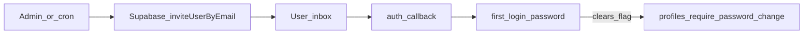

# Invite and automated reminder flow

End-to-end behavior for team invitations, first sign-in, manual resend, and optional automated reminders.

## Invite-only access

New users are created through **email invitations** (Supabase Auth `inviteUserByEmail`). Public sign-up is disabled in product configuration; see [`supabase/config.toml`](../supabase/config.toml) and [`lib/auth/invite-actions.ts`](../lib/auth/invite-actions.ts).

## End-to-end path (initial invite)

1. **Admin sends invite** — Server action `inviteTeamMember` in [`lib/auth/invite-actions.ts`](../lib/auth/invite-actions.ts): verifies org admin, applies admin rate limit ([`lib/auth/admin-invite-rate-limit.ts`](../lib/auth/admin-invite-rate-limit.ts)), blocks production if redirect origin is loopback ([`lib/site-url.ts`](../lib/site-url.ts)), then calls `adminClient.auth.admin.inviteUserByEmail` with `redirectTo` from [`getInviteEmailRedirectTo()`](../lib/auth/invite-email-redirect.ts) (callback → first password, `flow=invite`).
2. **Email** — Supabase sends the invite template (`[auth.email.template.invite]` in [`supabase/config.toml`](../supabase/config.toml)).
3. **Callback** — [`app/auth/callback/page.tsx`](../app/auth/callback/page.tsx) exchanges the code / verifies OTP / sets session, detects invite flow, redirects to first-password.
4. **First password** — [`app/auth/first-login-password/page.tsx`](../app/auth/first-login-password/page.tsx) and `submitSetPasswordAction` in [`lib/auth/password-actions.ts`](../lib/auth/password-actions.ts) set the password and clear `profiles.require_password_change` (service role only; enforced by trigger in [`supabase/migrations/20260502120000_single_admin_invite_auth.sql`](../supabase/migrations/20260502120000_single_admin_invite_auth.sql)).

## Manual resend

`resendTeamInvite` in [`lib/auth/invite-actions.ts`](../lib/auth/invite-actions.ts) reuses the same `redirectTo`. It refuses users who have already signed in and no longer need a password change. UI affordances use [`lib/org-users/admin-resend-invite.ts`](../lib/org-users/admin-resend-invite.ts) and settings components.

## Automated invite reminders (cron)

Optional scheduled job: [`app/api/cron/invite-reminders/route.ts`](../app/api/cron/invite-reminders/route.ts) (GET or POST). Logic lives in [`lib/auth/invite-reminder-cron.ts`](../lib/auth/invite-reminder-cron.ts); eligibility helpers are testable in [`lib/auth/invite-reminder-eligibility.ts`](../lib/auth/invite-reminder-eligibility.ts).

- **Auth**: Same `CRON_SECRET` pattern as other crons (`x-cron-secret` or `Authorization: Bearer`).
- **Throttle**: `profiles.last_automated_invite_reminder_at`, cooldown days, minimum user age before the first reminder, and a cap per run (see env vars below).
- **Abort in production** if `NEXT_PUBLIC_SITE_URL` resolves to a loopback origin (same guard as manual invites).

## Operations checklist

| Item                        | Notes                                                                                                    |
| --------------------------- | -------------------------------------------------------------------------------------------------------- |
| `NEXT_PUBLIC_SITE_URL`      | Public origin, no trailing slash, set on the host (e.g. Vercel Production).                              |
| Supabase **Site URL**       | Match the same origin.                                                                                   |
| Supabase **Redirect URLs**  | Include `https://<origin>/auth/callback`.                                                                |
| `SUPABASE_SERVICE_ROLE_KEY` | Server-only; required for invites and cron.                                                              |
| `CRON_SECRET`               | Required for cron routes; Vercel can send `Authorization: Bearer <CRON_SECRET>` when the env var exists. |

Optional tuning (defaults are safe in code):

- `INVITE_REMINDER_COOLDOWN_DAYS` — Days between automated reminders per user (default `7`).
- `INVITE_REMINDER_MIN_USER_AGE_HOURS` — Hours after Auth user creation before the **first** automated reminder (default `48`).
- `INVITE_REMINDER_MAX_PER_RUN` — Max successful sends per invocation (default `15`).

## Diagram

## Scheduling (Vercel)

[`vercel.json`](../vercel.json) defines a daily cron hitting `GET /api/cron/invite-reminders`. Vercel sends `Authorization: Bearer` using `CRON_SECRET` when that variable is set in the project. You can also trigger the route manually with the same secret.

## Quotas

Automated and manual invites count toward **Supabase Auth** and **SMTP** limits. Keep `INVITE_REMINDER_MAX_PER_RUN` and cooldowns conservative for large directories.
